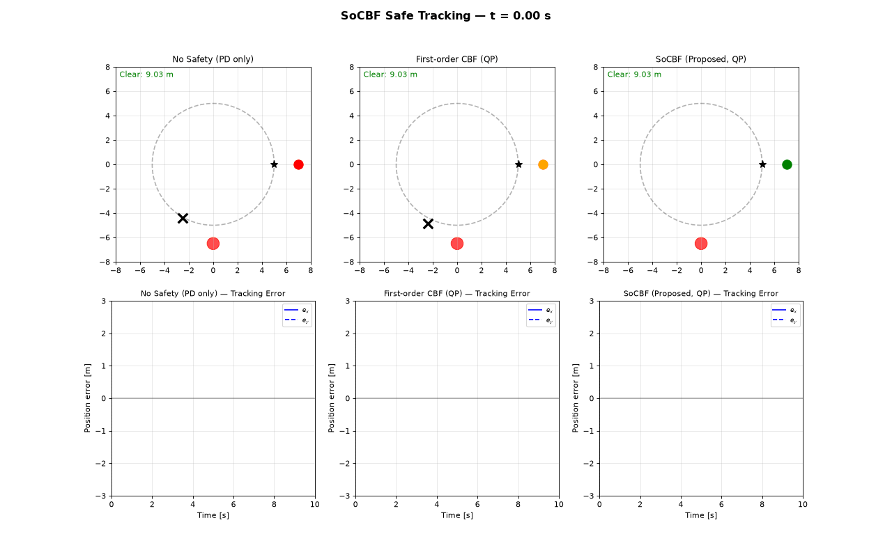

# Finite-Time Probabilistic Safe Tracking for Stochastic Double Integrators via Second-Order Control Barrier Function

This repository contains the simulation code and animation for the paper:

**Finite-Time Probabilistic Safe Tracking for Stochastic Double Integrators via Second-Order Control Barrier Function**

## Paper Abstract

This letter addresses safe tracking control for continuous-time stochastic double-integrator systems among dynamic obstacles. We develop a second-order control barrier function (SoCBF) that directly constrains the second time derivative of the safety function, making the control input explicitly appear in the safety constraint—a property absent in first-order CBFs for relative-degree-2 systems.

The main results are:
1. An explicit linear safety constraint whose QP admits a closed-form projection
2. A finite-time probabilistic safety theorem via Itô calculus and the exponential martingale inequality, giving an explicit collision-probability bound in terms of noise intensity, safety margin, and barrier gain
3. A plant-model-free safety layer that requires no identification of the controlled-plant dynamics, with robustness to obstacle-state estimation error at the position, velocity, and acceleration levels
4. Dynamic obstacles handled by a relative-coordinate transformation

Simulations on a 2D robot among three moving obstacles (N = 50 noise realizations) show SoCBF reduces collision steps from 19.0 ± 0.0 (PD baseline) and 12.7 ± 0.5 (first-order CBF) to 0.0 ± 0.0, with minimum clearance 0.403 ± 0.008 m and no degradation of steady-state tracking.

## Contents

- `socbf_strict_simulation.py`: Python implementation of the second-order control barrier function (SOCBF) strict safety tracking simulation
- `socbf_collision_markers_animation.gif`: Animation showing collision markers and safe tracking behavior among dynamic obstacles

## Animation

The animation demonstrates the robot's safe tracking behavior among three dynamic obstacles, showing the collision markers and the SoCBF safety layer preventing collisions while maintaining tracking performance.
